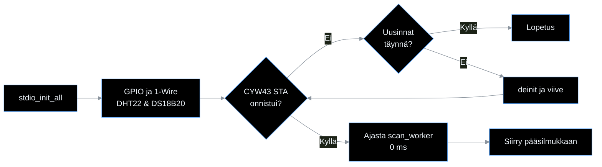

# Pico W – Jaanan picon alustusosio

Raspberry Pi Pico W:n mittaus-, 
tallennus- ja AWS-tiedonsiirtoprosessin alustusosio.

```mermaid
%%{init: {
  "theme": "base",
  "themeVariables": {
    "background": "#000000",
    "mainBkg": "#000000",
    "primaryColor": "#161b22",
    "primaryTextColor": "#f0f6fc",
    "primaryBorderColor": "#58a6ff",
    "lineColor": "#8b949e",
    "textColor": "#f0f6fc"
  }
}}%%
flowchart LR
    B[stdio_init_all]
    B --> C[GPIO ja 1-Wire\nDHT22 & DS18B20]
    C --> D{CYW43 STA\nonnistui?}
    D -->|Ei| E{Uusinnat\ntäynnä?}
    E -->|Kyllä| H[Lopetus]
    E -->|Ei| I[deinit ja viive]
    I --> D
    D -->|Kyllä| F[Ajasta scan_worker\n0 ms]
    F --> G[Siirry pääsilmukkaan]

```