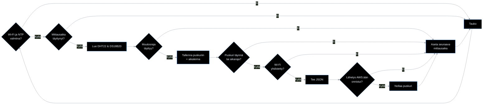

# Pico W – Jaanan picon toimintakaavion pääsilmukka

Raspberry Pi Pico W:n mittaus-, 
tallennus- ja AWS-tiedonsiirtoprosessin alustusosio.

```mermaid
%%{init: {
  "theme": "base",
  "themeVariables": {
    "background": "#000000",
    "mainBkg": "#000000",
    "primaryColor": "#161b22",
    "primaryTextColor": "#f0f6fc",
    "primaryBorderColor": "#58a6ff",
    "lineColor": "#8b949e",
    "textColor": "#f0f6fc"
  }
}}%%
flowchart LR
    B{Wi-Fi ja NTP\nvalmiina?}
    B -->|Ei| O[Tauko]
    B -->|Kyllä| C{Mittausaika\ntäyttynyt?}
    C -->|Ei| O
    C -->|Kyllä| D[Lue DHT22 & DS18B20]
    D --> E{Muutosraja\ntäyttyy?}
    E -->|Ei| K[Aseta seuraava\nmittausaika]
    E -->|Kyllä| F[Tallenna puskuriin\n+ aikaleima]
    F --> G{Puskuri täynnä\ntai aikaraja?}
    G -->|Ei| K
    G -->|Kyllä| H{Wi-Fi\nyhdistetty?}
    H -->|Ei| K
    H -->|Kyllä| J[Tee JSON]
    J --> L{Lähetys AWS:ään\nonnistui?}
    L -->|Ei| K
    L -->|Kyllä| M[Nollaa puskuri]
    M --> K
    K --> O
    O --> B


```