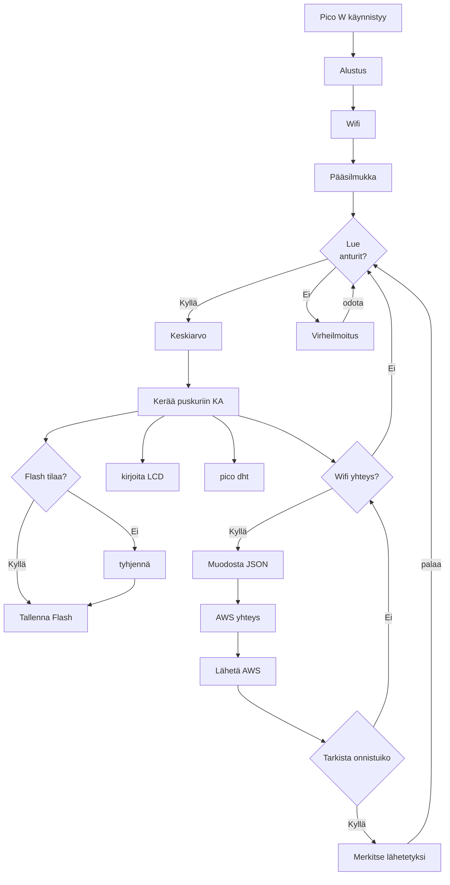

# Pico 2W – Petrin picon toimintakaavio

Projektin yleiskuvaus: Raspberry Pi Pico 2W:n mittaus-, 
tallennus- ja AWS-tiedonsiirtoprosessi.

```mermaid
flowchart TD
    A["Pico W käynnistyy"] -->B["Alustus"]
    B -->C["Wifi"]
    C -->D["Pääsilmukka"]
    D -->E{"Lue\nanturit?"} -->|Kyllä| F["Keskiarvo"]
    E -->|Ei| G["Virheilmoitus"]
    G -->|odota|E
    F -->H["Kerää puskuriin KA"]
    H -->I{"Flash tilaa?"}
    I -->|Kyllä| T["Tallenna Flash"]
    I -->|Ei| U["tyhjennä"]
    U -->T
    H -->S["kirjoita LCD"]
    H -->R["pico dht"]
    H -->J{"Wifi yhteys?"}
    J -->|Kyllä| K["Muodosta JSON"]
    J -->|Ei| E
    K -->M["AWS yhteys"]
    M -->N["Lähetä AWS"]
    N -->O{"Tarkista onnistuiko"}
    O -->|Kyllä| P["Merkitse lähetetyksi"]
    O -->|Ei| J
    P -->|palaa| E
```
